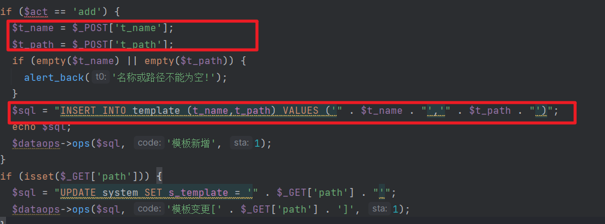

I found that there is an SQL injection issue in admin/cms_template.php, where the parameter is not properly filtered and is directly included in the SQL statement, leading to SQL injection when calling the query function.

POC:
```sql
333',(select user())); #
```